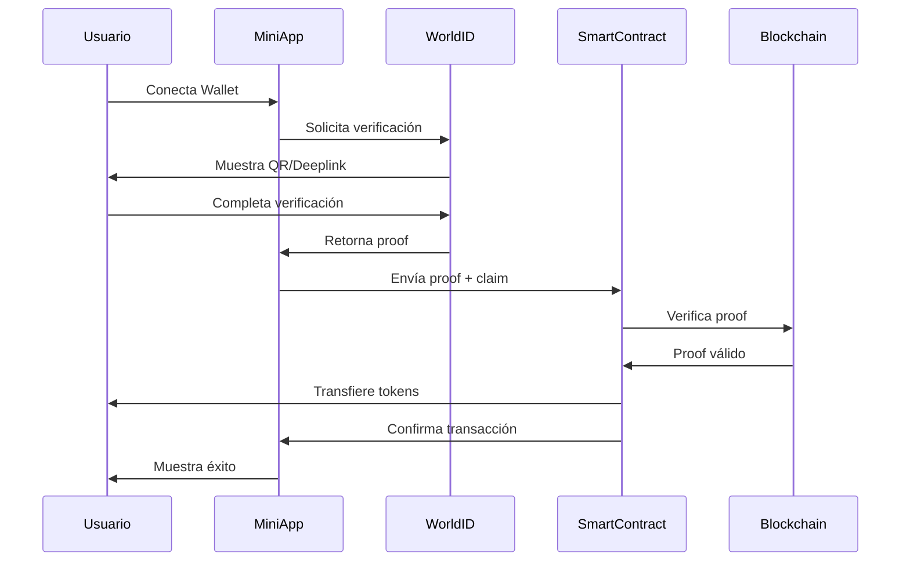

# Especificaciones Técnicas - Airdrop Lotería Jalapeño

## Descripción General

Este documento detalla las especificaciones técnicas para implementar un sistema de airdrop para el juego de lotería con temática de cultura mexicana (Jalapeño).

## Arquitectura del Sistema

### Stack Tecnológico

- **Frontend**: Next.js 15 con TypeScript
- **SDK**: MiniKit-JS (World App SDK)
- **Autenticación**: World ID + Wallet Auth
- **Blockchain**: World Chain (Mainnet/Sepolia)
- **Smart Contracts**: Solidity con Foundry
- **UI**: Mini Apps UI Kit

## Componentes del Airdrop

### 1. Smart Contract de Airdrop

```solidity
// Estructura básica del contrato
contract JalapenoLotteryAirdrop {
    // Mapping para rastrear claims
    mapping(uint256 => bool) public nullifierHashes;
    
    // Tokens disponibles para airdrop
    mapping(address => uint256) public airdropBalances;
    
    // Función para reclamar airdrop con World ID
    function claimAirdrop(
        uint256 root,
        uint256 nullifierHash,
        uint256[8] calldata proof
    ) external;
}
```

### 2. Integración con World ID

#### Verificación de Unicidad Humana

```typescript
// Configuración de IDKit para el airdrop
const verifyAirdropClaim = async () => {
  const rpContext = await fetch('/api/rp-signature', {
    method: 'POST',
    body: JSON.stringify({ action: 'claim-jalapeno-airdrop' })
  }).then(r => r.json());

  const request = await IDKit.request({
    app_id: process.env.NEXT_PUBLIC_APP_ID,
    action: 'claim-jalapeno-airdrop',
    rp_context: rpContext,
    allow_legacy_proofs: true,
  }).preset(orbLegacy({ signal: userAddress }));

  const response = await request.pollUntilCompletion();
  return response;
};
```

### 3. Sistema de Distribución

#### Criterios de Elegibilidad

1. **Verificación World ID**: Usuario debe tener verificación Orb
2. **Una reclamación por persona**: Uso de nullifier para prevenir duplicados
3. **Wallet conectado**: Debe tener World App wallet activo

#### Cantidades de Airdrop

```typescript
interface AirdropTier {
  tier: 'bronze' | 'silver' | 'gold' | 'platinum';
  amount: number;
  requirements: {
    worldIdVerified: boolean;
    minTransactions?: number;
    earlyAdopter?: boolean;
  };
}

const AIRDROP_TIERS: AirdropTier[] = [
  {
    tier: 'bronze',
    amount: 100,
    requirements: { worldIdVerified: true }
  },
  {
    tier: 'silver', 
    amount: 250,
    requirements: { worldIdVerified: true, minTransactions: 5 }
  },
  {
    tier: 'gold',
    amount: 500,
    requirements: { worldIdVerified: true, minTransactions: 20 }
  },
  {
    tier: 'platinum',
    amount: 1000,
    requirements: { worldIdVerified: true, earlyAdopter: true }
  }
];
```

## Flujo de Reclamación de Airdrop

### Diagrama de Flujo



### Pasos de Implementación

1. **Conexión de Wallet**
```typescript
const { finalPayload } = await MiniKit.commandsAsync.walletAuth({
  nonce: nonce,
  expirationTime: new Date(Date.now() + 7 * 24 * 60 * 60 * 1000),
  statement: 'Conecta tu wallet para reclamar el airdrop de Jalapeño Lottery'
});
```

2. **Verificación World ID**
```typescript
const verificationResult = await verifyAirdropClaim();
```

3. **Reclamación en Smart Contract**
```typescript
const claimAirdrop = async (proof: ProofData) => {
  const tx = await contract.claimAirdrop(
    proof.merkle_root,
    proof.nullifier_hash,
    proof.proof
  );
  await tx.wait();
};
```

## Imágenes de Airdrop (Cultura Mexicana)

### Elementos Visuales Requeridos

1. **Jalapeño Mascota**
   - Formato: PNG con transparencia
   - Tamaño: 512x512px
   - Variantes: Normal, Feliz, Celebrando

2. **Iconos de Recompensa**
   - Chili Bronze (100 tokens)
   - Chili Silver (250 tokens)
   - Chili Gold (500 tokens)
   - Chili Platinum (1000 tokens)

3. **Fondos Temáticos**
   - Patrón de sarape mexicano
   - Colores: Verde, blanco, rojo (bandera mexicana)
   - Elementos: Cactus, sombreros, maracas

### Directorio de Assets

```
/public
  /images
    /airdrop
      /jalapeno
        - mascot-normal.png
        - mascot-happy.png
        - mascot-celebrating.png
      /tiers
        - bronze-chili.png
        - silver-chili.png
        - gold-chili.png
        - platinum-chili.png
      /backgrounds
        - sarape-pattern.png
        - mexican-theme-bg.png
```

## Seguridad

### Prevención de Sybil Attacks

1. **World ID Orb Verification**: Garantiza un humano único
2. **Nullifier Tracking**: Previene reclamaciones múltiples
3. **Rate Limiting**: Límite de intentos por IP
4. **Smart Contract Auditing**: Auditoría antes de deployment

### Validación Backend

```typescript
// api/verify-airdrop-claim/route.ts
export async function POST(request: Request) {
  const { proof, walletAddress } = await request.json();
  
  // Verificar proof con World ID
  const verifyResponse = await fetch(
    `https://developer.worldcoin.org/api/v4/verify/${process.env.RP_ID}`,
    {
      method: 'POST',
      headers: { 'Content-Type': 'application/json' },
      body: JSON.stringify(proof)
    }
  );
  
  if (!verifyResponse.ok) {
    return NextResponse.json({ error: 'Invalid proof' }, { status: 400 });
  }
  
  // Verificar que no haya reclamado antes
  const hasClaimedBefore = await checkNullifier(proof.nullifier_hash);
  if (hasClaimedBefore) {
    return NextResponse.json({ error: 'Already claimed' }, { status: 400 });
  }
  
  return NextResponse.json({ success: true });
}
```

## Deployment

### Contratos en World Chain

```bash
# Compilar contratos
forge build

# Deploy a Sepolia (testing)
forge create src/JalapenoLotteryAirdrop.sol:JalapenoLotteryAirdrop \
  --rpc-url https://worldchain-sepolia.g.alchemy.com/public \
  --private-key $PRIVATE_KEY

# Deploy a Mainnet (producción)
forge create src/JalapenoLotteryAirdrop.sol:JalapenoLotteryAirdrop \
  --rpc-url https://worldchain-mainnet.g.alchemy.com/public \
  --private-key $PRIVATE_KEY \
  --verify
```

### Variables de Entorno

```env
# World ID
NEXT_PUBLIC_APP_ID=app_xxxxx
NEXT_PUBLIC_RP_ID=rp_xxxxx
RP_SIGNING_KEY=xxxxx

# Contratos
AIRDROP_CONTRACT_ADDRESS=0x...
LOTTERY_TOKEN_ADDRESS=0x...

# RPC
WORLD_CHAIN_RPC_URL=https://worldchain-mainnet.g.alchemy.com/public
```

## Monitoreo y Analytics

### Métricas Clave

1. **Total de reclamaciones exitosas**
2. **Distribución por tier**
3. **Tasa de conversión (visitas → claims)**
4. **Usuarios únicos verificados**
5. **Tokens distribuidos totales**

### Dashboard de Analytics

```typescript
interface AirdropAnalytics {
  totalClaims: number;
  totalTokensDistributed: number;
  claimsByTier: Record<string, number>;
  uniqueUsers: number;
  conversionRate: number;
}
```

## Testing

### Test Cases Críticos

1. ✅ Usuario puede reclamar airdrop con World ID válido
2. ✅ Usuario no puede reclamar dos veces (nullifier check)
3. ✅ Proof inválido es rechazado
4. ✅ Tokens son transferidos correctamente
5. ✅ Gas es cubierto para usuarios verificados

### Comandos de Testing

```bash
# Tests unitarios
forge test

# Tests de integración
npm run test:integration

# Tests E2E
npm run test:e2e
```

## Roadmap de Implementación

### Fase 1: Setup (Semana 1)
- [ ] Configurar proyecto Next.js
- [ ] Integrar MiniKit
- [ ] Crear smart contracts básicos

### Fase 2: Desarrollo (Semana 2-3)
- [ ] Implementar lógica de airdrop
- [ ] Integrar World ID verification
- [ ] Diseñar UI con temática mexicana

### Fase 3: Testing (Semana 4)
- [ ] Deploy a Sepolia
- [ ] Testing exhaustivo
- [ ] Auditoría de seguridad

### Fase 4: Launch (Semana 5)
- [ ] Deploy a Mainnet
- [ ] Campaña de marketing
- [ ] Monitoreo activo

## Especificaciones del Juego de Lotería

### Arquitectura de Componentes

#### GameCanvas (Componente Principal)
```typescript
interface GameCanvasState {
  // Estados de juego
  gameStarted: boolean;
  isPlaying: boolean;
  isManualMode: boolean;
  isPaused: boolean;
  
  // Puntuación
  humanScore: number;
  iaScore: number;
  
  // Cartas y tableros
  currentCard: Card | null;
  currentBoardIndex: number;
  allBoards: Card[][]; // 10 tableros de 16 cartas
  iaCards: Card[]; // Tablero IA de 16 cartas
  remainingCards: Card[]; // Cartas por cantar
  
  // Marcado
  selectedIds: number[]; // Cartas marcadas por usuario
  iaSelectedIds: number[]; // Cartas marcadas por IA
  cantadasIds: number[]; // Cartas ya cantadas
}
```

#### Tablero (Componente de Tablero)
```typescript
interface TableroProps {
  cartas: Card[]; // 16 cartas del tablero
  seleccionadoIds?: number[]; // IDs de cartas seleccionadas
  cantadasIds?: number[]; // IDs de cartas cantadas
  disabled?: boolean; // Deshabilitar interacción
  onSeleccionar?: (carta: Card) => void; // Callback de selección
  showOverlay?: boolean; // Mostrar overlay de bloqueo
  overlayTitle?: string; // Título del overlay
  showPeanut?: boolean; // Mostrar cacahuate en modo manual
}
```

#### CartaCantada (Componente de Carta Actual)
```typescript
interface CartaCantadaProps {
  carta?: Card; // Carta actual cantada
  isPlaying: boolean; // Estado de reproducción
  onPlayPause: () => void; // Toggle play/pause
}
```

#### CarruselOverlay (Componente de Selección)
```typescript
interface CarruselOverlayProps {
  currentIndex: number; // Índice del tablero actual
  totalBoards: number; // Total de tableros (10)
  onPrev: () => void; // Navegar anterior
  onNext: () => void; // Navegar siguiente
  onSelect: () => void; // Seleccionar tablero
}
```

### Sistema de Cantador con Voz

#### Web Speech API Integration
```typescript
// Implementación en GameCanvas
useEffect(() => {
  if (gameStarted && isPlaying && remainingCards.length > 0) {
    const interval = setInterval(() => {
      const nextCard = remainingCards[0];
      setCurrentCard(nextCard);
      setCantadasIds(prev => [...prev, nextCard.id]);
      setRemainingCards(prev => prev.slice(1));
      
      // Síntesis de voz
      if ('speechSynthesis' in window) {
        const utterance = new SpeechSynthesisUtterance(nextCard.name);
        utterance.lang = 'es-MX'; // Español mexicano
        utterance.rate = 0.9; // Velocidad natural
        window.speechSynthesis.speak(utterance);
      }
      
      // Marcado automático según modo
      if (!isManualMode) {
        setSelectedIds(prev => [...prev, nextCard.id]);
      }
      
      // IA siempre marca automáticamente
      if (iaCards.some(c => c.id === nextCard.id)) {
        setIaSelectedIds(prev => [...prev, nextCard.id]);
      }
    }, 3000); // Cada 3 segundos
    
    return () => clearInterval(interval);
  }
}, [gameStarted, isPlaying, remainingCards, isManualMode, iaCards]);
```

### Modos de Juego

#### Modo Automático (Default)
```typescript
// Características:
- Marcado automático al cantar carta
- Tableros mismo tamaño
- Overlay amarillo en cartas cantadas
- Ideal para juego rápido

// Implementación:
if (!isManualMode) {
  setSelectedIds(prev => [...prev, nextCard.id]);
}
```

#### Modo Manual
```typescript
// Características:
- Usuario marca con cacahuate 🥜
- Solo puede marcar cartas cantadas
- Tablero humano x4 más grande (flex-[4])
- Tablero IA x3 más pequeño (scale-[0.33])
- IA marca automáticamente

// Implementación:
const handleSelect = (carta: Card) => {
  if (isManualMode && cantadasIds.includes(carta.id)) {
    setSelectedIds(prev => 
      prev.includes(carta.id) 
        ? prev.filter(id => id !== carta.id) 
        : [...prev, carta.id]
    );
  }
};
```

### Sistema de Marcado Visual

#### Overlay de Carta Cantada
```tsx
// En Tablero component
{isCantada && (
  <div className="absolute inset-0 bg-yellow-400/40 border-2 border-yellow-500 rounded-xl animate-pulse" />
)}
```

#### Cacahuate en Modo Manual
```tsx
// En Tablero component
{showPeanut && isSelected && (
  <div className="absolute inset-0 flex items-center justify-center pointer-events-none">
    <div className="text-6xl">🥜</div>
  </div>
)}
```

### Generación de Tableros Aleatorios

```typescript
const generateRandomBoard = () => {
  const shuffled = [...LOTTERY_CARDS].sort(() => Math.random() - 0.5);
  return shuffled.slice(0, 16); // 16 cartas únicas
};

// Generar 10 tableros únicos
const [allBoards] = useState(() => 
  Array.from({ length: 10 }, () => generateRandomBoard())
);

// Tablero IA único
const [iaCards] = useState(() => generateRandomBoard());
```

### Controles de UI

#### Botón Play/Pause
```tsx
<button
  onClick={onPlayPause}
  className="w-full py-3 rounded-lg font-bold text-white text-lg shadow-lg"
  style={{ backgroundColor: isPlaying ? '#ef4444' : '#16a34a' }}
>
  {isPlaying ? '⏸️ PAUSAR' : '▶️ CANTAR'}
</button>
```

#### Botón Modo Manual/Automático
```tsx
<button
  onClick={() => setIsManualMode(!isManualMode)}
  className="w-full py-3 rounded-lg font-bold text-white text-sm shadow-lg"
  style={{ backgroundColor: isManualMode ? '#8b5cf6' : '#3b82f6' }}
>
  {isManualMode ? '🥜 MANUAL' : '🤖 AUTO'}
</button>
```

### Layout Responsivo

#### Modo Automático
```tsx
<div className="flex gap-4 h-full">
  <div className="flex-1 flex flex-col gap-2">
    {/* Tablero Humano */}
    <Tablero cartas={allBoards[currentBoardIndex]} />
    
    {/* Tablero IA - tamaño normal */}
    <Tablero cartas={iaCards} />
  </div>
  
  <div className="w-[20%] max-w-25">
    {/* Carta cantada + controles */}
  </div>
</div>
```

#### Modo Manual
```tsx
<div className="flex gap-4 h-full">
  <div className="flex-[4] flex flex-col gap-2">
    {/* Tablero Humano - 4x más grande */}
    <Tablero cartas={allBoards[currentBoardIndex]} showPeanut={true} />
    
    {/* Tablero IA - 3x más pequeño */}
    <div className="scale-[0.33] origin-top">
      <Tablero cartas={iaCards} />
    </div>
  </div>
  
  <div className="w-[20%] max-w-25">
    {/* Carta cantada + controles */}
  </div>
</div>
```

### Overlay Condicional de IA

```tsx
<Tablero 
  cartas={iaCards}
  seleccionadoIds={iaSelectedIds}
  cantadasIds={cantadasIds}
  disabled={true}
  showOverlay={!isPlaying} // Se quita al presionar CANTAR
  overlayTitle="TABLERO IA"
/>
```

### Carrusel de Tableros

#### Flechas de Navegación
```tsx
// Flecha izquierda
<button
  onClick={onPrev}
  disabled={currentIndex === 0}
  style={{
    padding: '0',
    backgroundColor: 'transparent',
    color: 'white',
    fontSize: '80px', // Flechas grandes
    fontWeight: 'bold',
    border: 'none',
    cursor: 'pointer',
    opacity: currentIndex === 0 ? 0.3 : 1
  }}
>
  ←
</button>

// Flecha derecha
<button
  onClick={onNext}
  disabled={currentIndex === totalBoards - 1}
  style={{
    padding: '0',
    backgroundColor: 'transparent',
    color: 'white',
    fontSize: '80px',
    fontWeight: 'bold',
    border: 'none',
    cursor: 'pointer',
    opacity: currentIndex === totalBoards - 1 ? 0.3 : 1
  }}
>
  →
</button>
```

#### Botón Seleccionar
```tsx
<button
  onClick={onSelect}
  style={{
    padding: '24px 36px',
    borderRadius: '16px',
    backgroundColor: '#ef4444', // Rojo
    color: 'white',
    fontSize: '24px',
    fontWeight: 'bold',
    border: 'none',
    cursor: 'pointer',
    boxShadow: '0 20px 25px -5px rgba(0, 0, 0, 0.3)'
  }}
>
  SELECCIONAR
</button>
```

### Performance y Optimización

#### Memoización de Tableros
```typescript
// Generar tableros solo una vez
const [allBoards] = useState(() => 
  Array.from({ length: 10 }, () => generateRandomBoard())
);
```

#### Cleanup de Intervalos
```typescript
useEffect(() => {
  const interval = setInterval(() => {
    // Lógica de cantador
  }, 3000);
  
  return () => clearInterval(interval); // Cleanup
}, [dependencies]);
```

#### Transiciones CSS
```css
/* Transiciones suaves en cambio de modo */
.transition-all {
  transition: all 0.3s ease-in-out;
}
```

## Recursos Adicionales

- [World ID Documentation](https://docs.world.org/world-id)
- [MiniKit SDK](https://github.com/worldcoin/minikit-js)
- [World Chain Contracts](https://docs.world.org/world-chain/developers/world-chain-contracts)
- [Foundry Book](https://book.getfoundry.sh/)
- [Web Speech API](https://developer.mozilla.org/en-US/docs/Web/API/Web_Speech_API)

## Contacto y Soporte

- Telegram: [@worlddevelopersupport](https://t.me/worlddevelopersupport)
- Discord: [World Discord](https://world.org/discord)
- Email: [grants@worldcoin.org](mailto:grants@worldcoin.org)
