# Flujo Visual - Arquitectura Jalapeño Lottery

## Diagrama de Arquitectura General

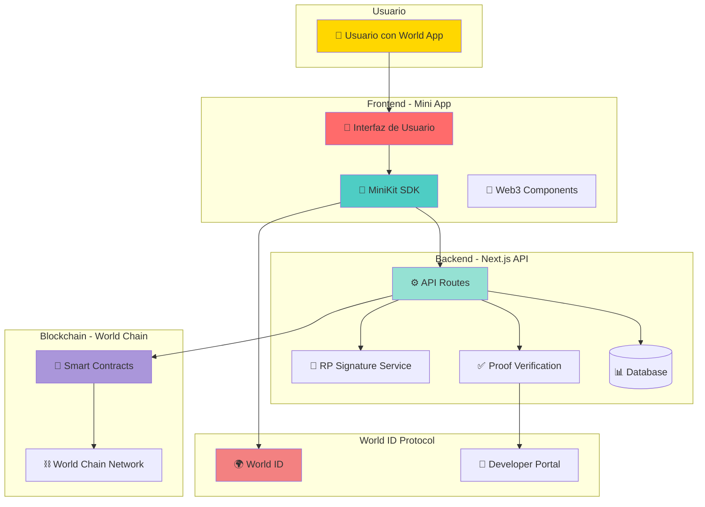

## Flujo de Usuario Completo

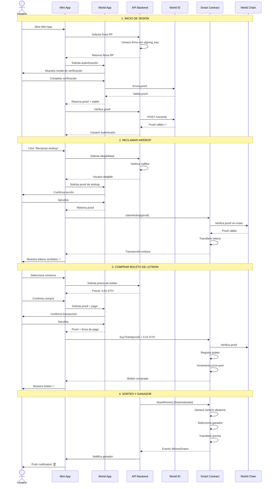

## Arquitectura de Componentes

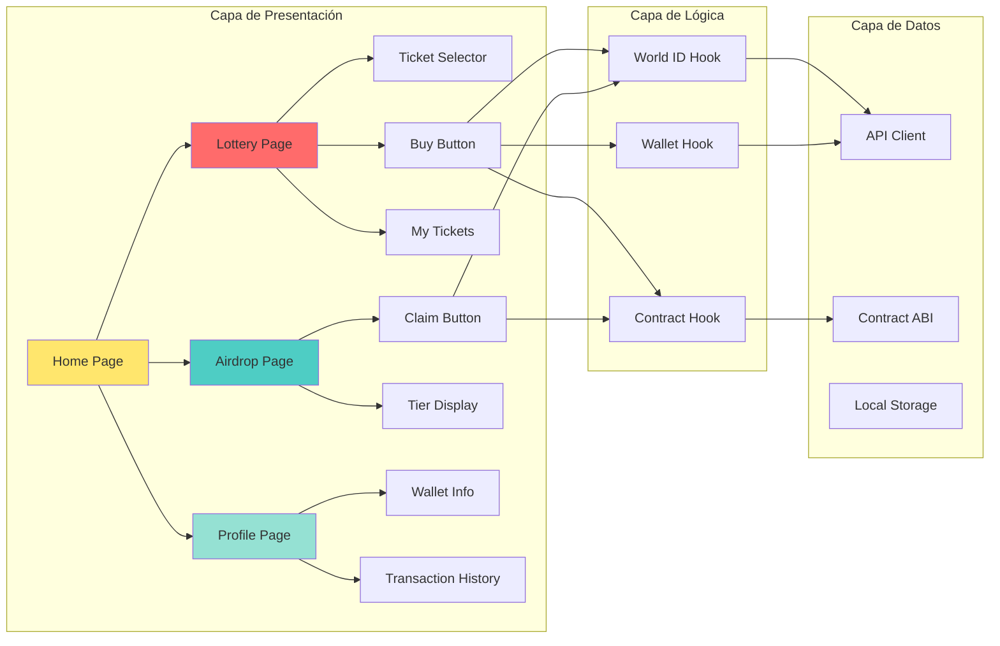

## Flujo de Smart Contracts

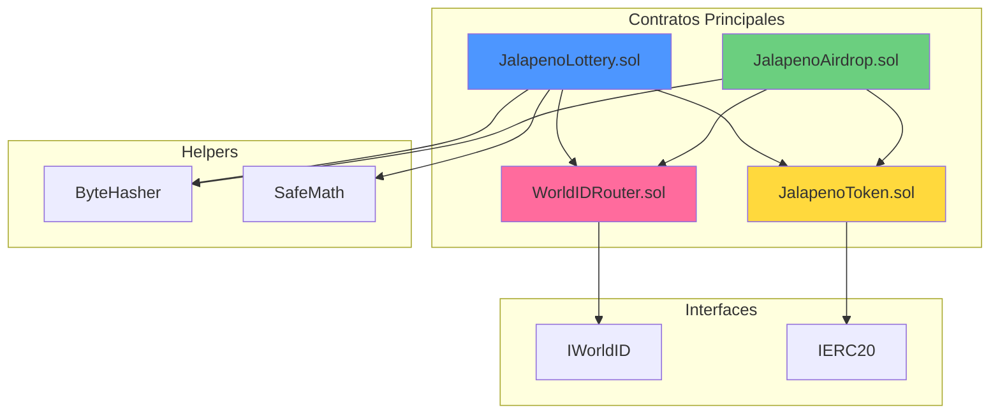

## Estados de la Aplicación

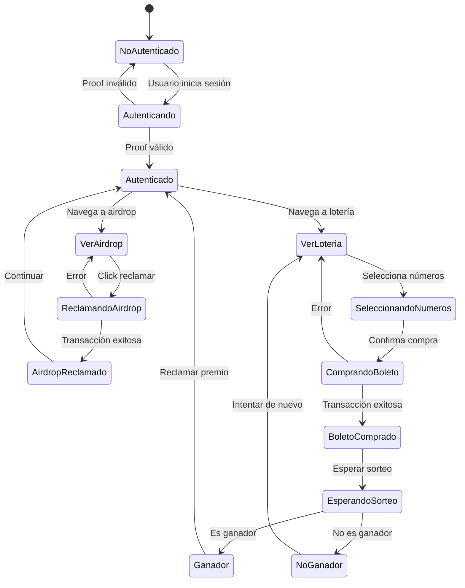

## Flujo de Datos

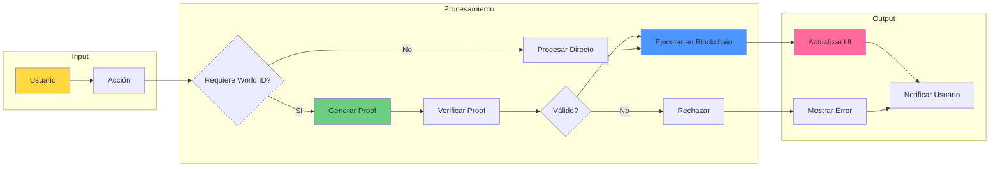

## Estructura de Base de Datos

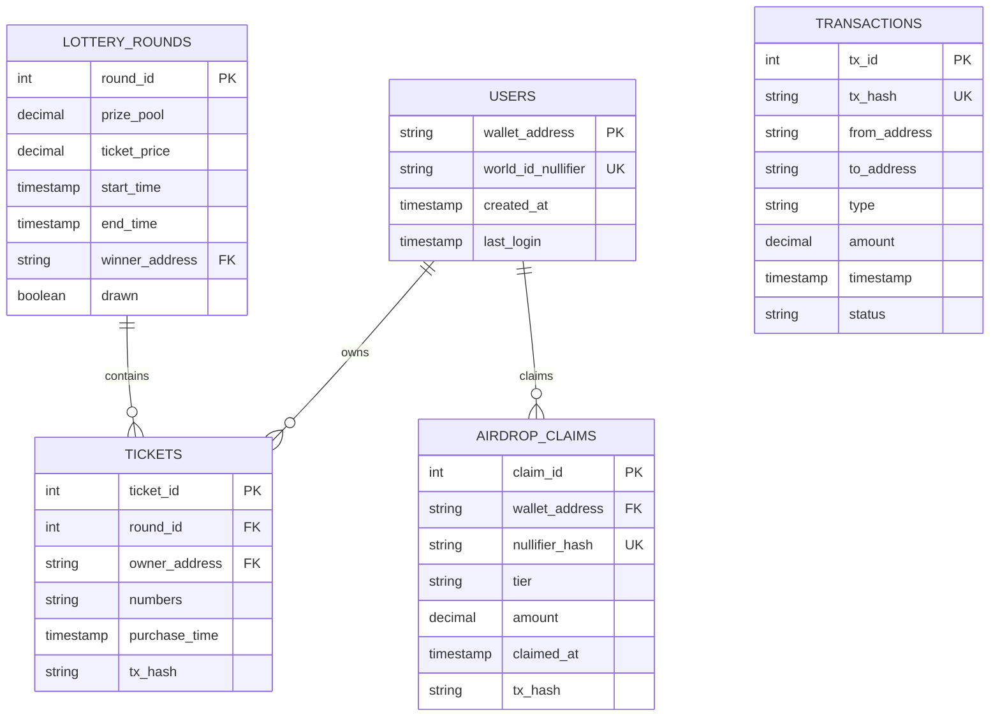

## Ciclo de Vida de una Ronda de Lotería

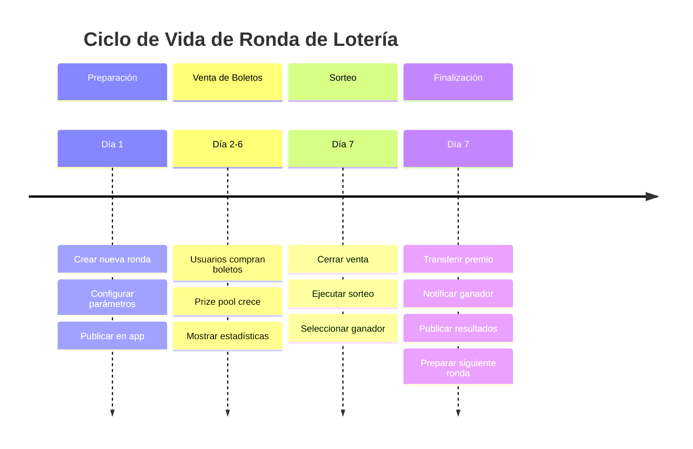

## Integración con World ID

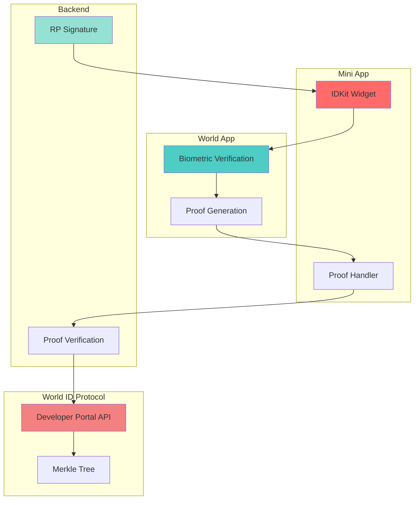

## Flujo de Seguridad

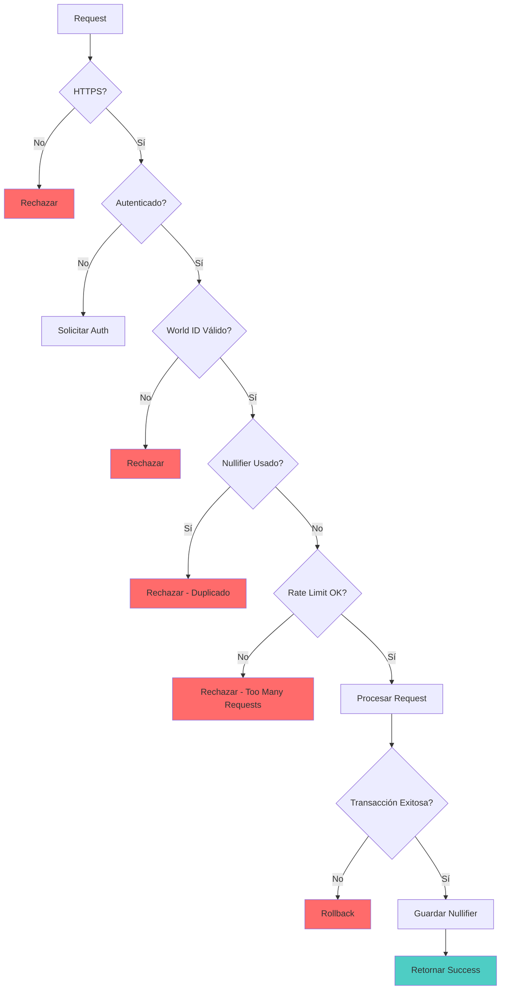

## Deployment Pipeline

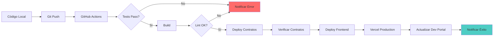

## Monitoreo y Analytics

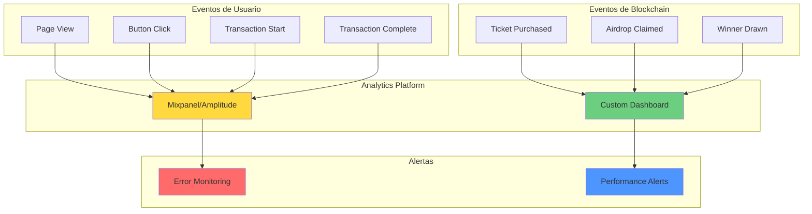

## Resumen de Tecnologías

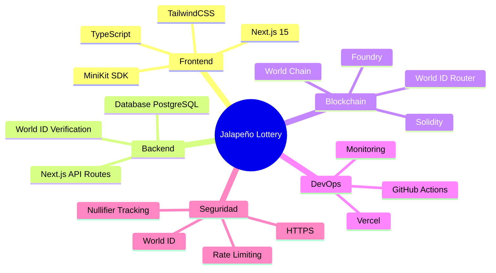

---

## Leyenda de Colores

- 🟡 **Amarillo**: Componentes de Usuario
- 🔴 **Rojo**: Componentes de Frontend
- 🔵 **Azul**: Componentes de Backend
- 🟢 **Verde**: Componentes de Blockchain
- 🟣 **Morado**: Servicios Externos

---

**Nota**: Todos estos diagramas son visualizaciones de alto nivel. Para detalles de implementación específicos, consultar los documentos de Especificaciones Técnicas y Protocolo de Desarrollo.
